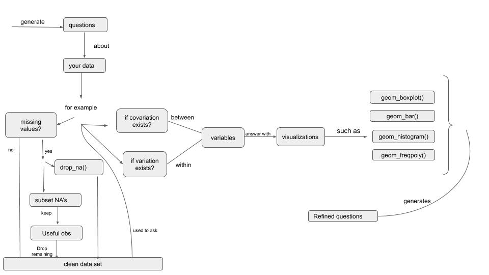

# RStudio Instructor Training

This repo contains the materials I put together for the RStudio Teaching
Exam. Feel free to share and re-use.

## Sample Lesson

### Slides

<https://eda-in-r.netlify.app/>

### Formative Assesments

<https://56doors.shinyapps.io/formative_assessment/>

## Learner Persona

## Soo Youn

  - Soo Youn is an equity analyst at an a large wealth management firm
    in Toronto. Her western name is Anne but recently made the shift to
    being addressed by her Korean name.

  - In her last role she primarily worked on ETL(Extract Transform Load)
    tasks within Jupyter notebooks using Python and R. She is familiar
    with dplyr and pipes and finds them very useful. She also has
    beginner knowledge of ggplot having inherited an ETL script which
    included histograms and scatter plots.

  - Soo Youn’s boss hoards alternative data believing that nuggets gold
    of exists within them. She is constantly being asked to assess the
    datasets to see if anything of value exists. Her boss is an R
    Evangelist and she believes she can score extra brownie points if
    she creates analysis that he can easily re-use.

  - Soo Youn has an extremely heavy workload and a newborn who keeps her
    up all night

## Concept Map

