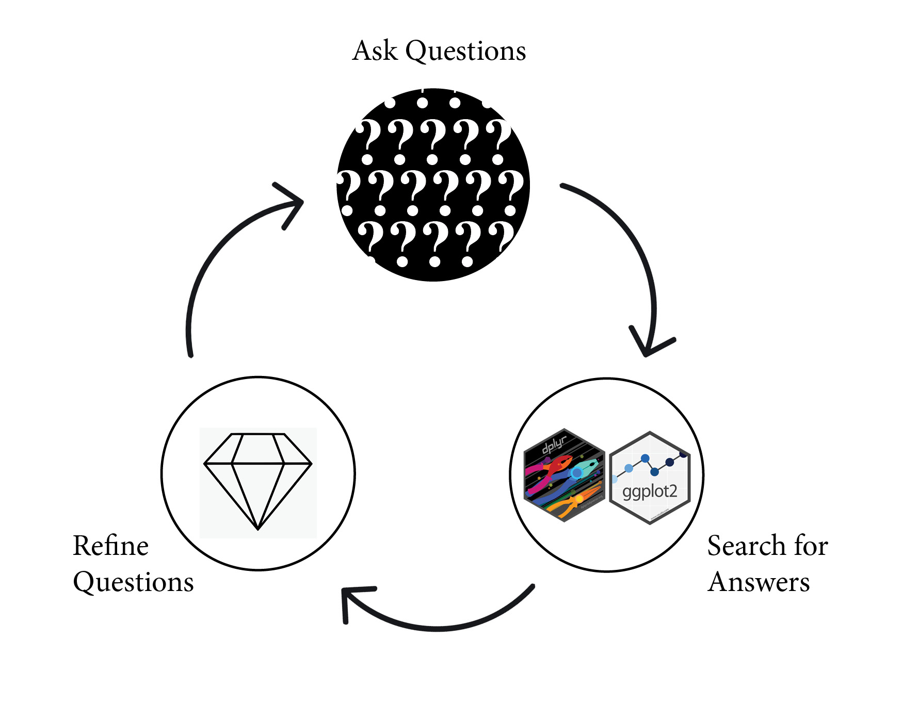

```{r setup, include=FALSE}
options(htmltools.dir.version = FALSE)
library(palmerpenguins)
library(tidyverse)
# Get your data which ever one you are using 
```
class: inverse, center, middle

# Introduction
       - Mandip Mistry
--
       - Using R for the past 4 years
--
      - Background in Finance
--
      - Have a 1 year old daughter who believes I don't deserve to sleep 
???
10 seconds

---
# House Keeping

Open the below links in three different tabs in your browser

 - [Slides]()
 - [Formative Assessment](https://56doors.shinyapps.io/formative_assessment/)
 - [RStudio Cloud](https://rstudio.cloud/project/1970032)

???
10-15 seconds

Feel free to put your questions in the chat or use the raise hand function to speak
and ask a question

---
# Learning Objectives

 -  **Remember** the three systematic steps that make up EDA
 
--

 -  **Review** how to deal with and report on missing data using the Tidyverse when 
conducting EDA in R

--

 - **Apply** the geom_boxplot and geom_jitter function to examine the mean and spread of centrality of variables in the data set


???
30 Seconds
---
class: center
## The EDA Cycle


---
background-image: url(img/penguins_hex.png)
background-position: 90% 5%
background-size: 10%

## Palmer Penguins

```{r warning=FALSE, message=FALSE}
library(palmerpenguins)
library(tidyverse)
```

```{r}
glimpse(penguins)
```

???

A data set that is an alternative to to the iris data set.

The dataset contain data for 344 penguins. There are 3 different species of penguins in this dataset, collected from 3 islands in the Palmer Archipelago, Antarctica.

---

## Ask many questions

- What are the data types in my data set?

--
  
- How many records are there?
  
--
 
- Are there are any missing values?
 
--
 
- Is there variation within my variables?
 
--
 
- Is there co-variation between my variables?

???

The list can go on and on

The key is to ask a large quantity of questions which ultimately leads to 
quality questions

---
## Can't answer them all today 

--
 
 -  Are there are any missing values?
 
--
 
 - Is there variation within my variables?
 
--

 - Is there co-variation between my variables?
 
--

 - Lets Recap First (head to https://56doors.shinyapps.io/formative_assessment/)


???

Not in this lesson at least but lets answer the questions you should always 
ask of your data before moving forward

Focus on today are what do with missing values?

Does variation exist within my variables?
Does co-variation exist between  my variables?
 
---
## Missing Values 


???

Live Coding
Move to Live Coding

---
## Flipper Length Distributions

 - What do you think the below code displays?
 
 - Type your answers in chat. 

```{r eval=FALSE}
ggplot(data = penguins, aes(x = species, y = flipper_length_mm)) +
  geom_boxplot(aes(color = species), width = 0.3, show.legend = FALSE) +
  geom_jitter(aes(color = species), alpha = 0.5, show.legend = FALSE, position = position_jitter(width = 0.2, seed = 0)) +
  scale_color_manual(values = c("darkorange","purple","cyan4")) +
  theme_minimal() +
  labs(x = "Species",
       y = "Flipper length (mm)")
```

???
Now head over

## Flipper Length Distributions

```{r}
ggplot(data = penguins, aes(x = species, y = flipper_length_mm)) +
  geom_boxplot(aes(color = species), width = 0.3, show.legend = FALSE) +
  geom_jitter(aes(color = species), alpha = 0.5, show.legend = FALSE, position = position_jitter(width = 0.2, seed = 0)) +
  scale_color_manual(values = c("darkorange","purple","cyan4")) +
  theme_minimal() +
  labs(x = "Species",
       y = "Flipper length (mm)")
```

???
Now head over
---
## Flipper Length Distributions

data, x-axis, y-axis

```{r eval=FALSE}
ggplot(data = penguins, aes(x = species, y = flipper_length_mm)) +
```  

--

box and whiskers plot

```{r eval=FALSE}
  geom_boxplot(aes(color = species), width = 0.3, show.legend = FALSE) +
```

--

visualize the conditional distribution 

```{r eval =FALSE}
  geom_jitter(aes(color = species), alpha = 0.5, show.legend = FALSE, 
              position = position_jitter(width = 0.2, seed = 0))+
```

--

label and color the plot

```{r eval=FALSE}
  scale_color_manual(values = c("darkorange","purple","cyan4")) +
  theme_minimal() +
  labs(x = "Species",
       y = "Flipper length (mm)")

```

???
A box plot (also known as box and whisker plot) is a type of chart often used in explanatory data analysis to visually show the distribution of numerical data and skewness through displaying the data quartiles (or percentiles) and averages.

The jitter geom is a convenient shortcut for geom_point(position = "jitter"). It adds a small amount of random variation to the location of each point, and is a useful way of handling overplotting caused by discreteness in smaller datasets.

Color and Titles

---
background-position: 90% 5%
background-size: 10%
##Flipper Length Distributions

```{r, echo = FALSE, warning=FALSE}
ggplot(data = penguins, aes(x = species, y = flipper_length_mm)) +
  geom_boxplot(aes(color = species), width = 0.3, show.legend = FALSE) +
  geom_jitter(aes(color = species), alpha = 0.5, show.legend = FALSE, position = position_jitter(width = 0.2, seed = 0)) +
  scale_color_manual(values = c("darkorange","purple","cyan4")) +
  theme_minimal() +
  labs(x = "Species",
       y = "Flipper length (mm)")
```
---